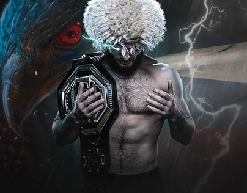
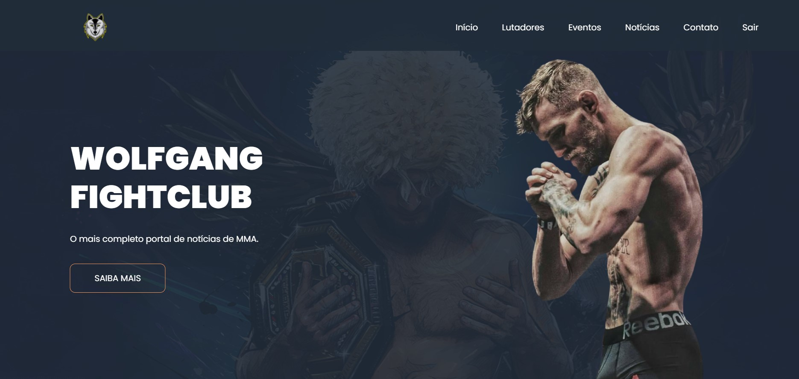
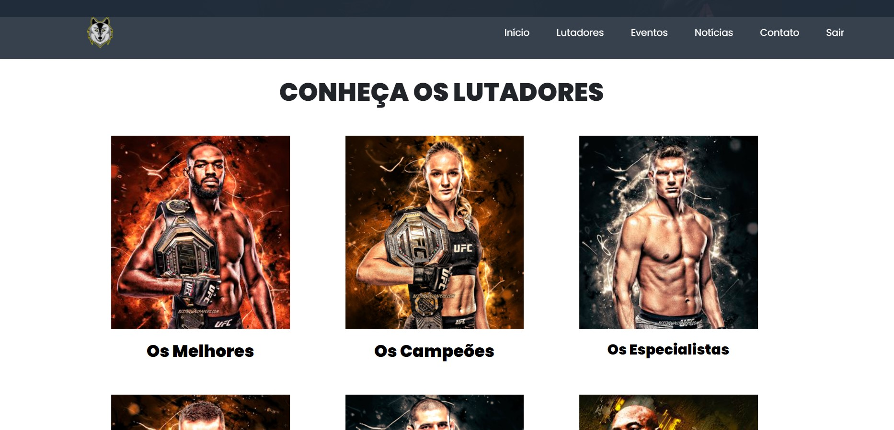
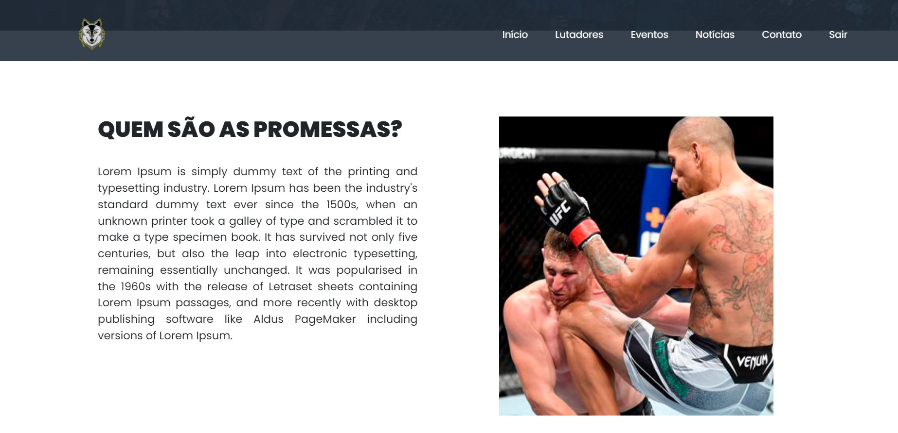
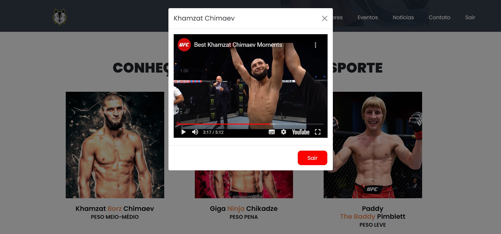
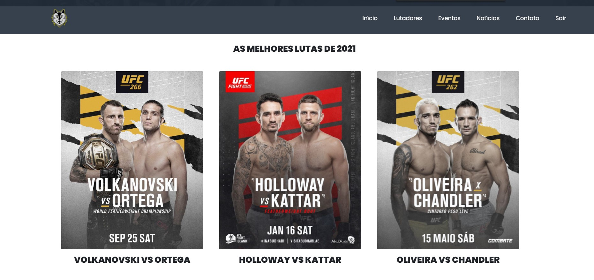

<h1 align="center">
    
</h1>

# Summary

- [Description](#📝-Description)
- [Project](#💻-Project)
- [Technologies](#🚀-Technologies)
- [Project Stats](#🎯-Project-Stats)

---

## 📝 Description

> This was my first personal project using PHP, i've decide to do this project to practice my skills in PHP after finishing a couple of courses in Udemy.  
> I'm a huge MMA fan and because of this i've decide to make a website inspired in MMA.  
> My goal while developing this project was to use as many different PHP features as possible.

---

## 💻 Project
> You can use this code by downloading the project folder and running with a PHP Local Server like Wamp or Xamp.  
> Do not forget to install the database in phpMyAdmin.

<h1 align="center">
    
</h1>
<h1 align="center">
    
</h1>
<h1 align="center">
    
</h1>
<h1 align="center">
    
</h1>
<h1 align="center">
    
</h1>
<h1 align="center">
    
</h1>

---

## 🚀 Technologies
This project was developed with the following technologies:
* VS Code;
* HTML;
* CSS;
* Bootstrap;
* PHP

---

## 🎯 Project Stats

This project is currently finished.

---

## :heavy_check_mark: To do list

- Add more content
- Code optimization (performance and or developer organization)

---

## :handshake: Become a Contributor

Do you have any ideas that you want to implement it? It's simple!

1. Fork the project
2. Modify what you think is necessary
3. Commit the changes
4. Create a Pull Request

---

## Author

- Projetos - [Lucass2021](https://github.com/Lucass2021)

- Linkedin - [@Lucas Dias da Silva](https://www.linkedin.com/in/lucas-dias-da-silva-118954199/)

- Email - [Lucas Dias](mailto:lucas.allx@hotmail.com")
